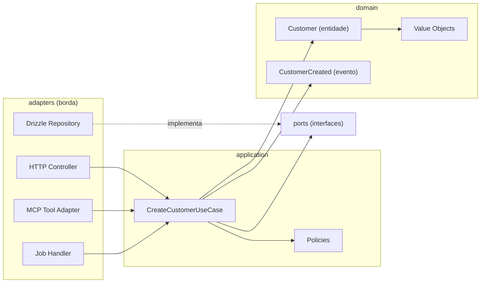
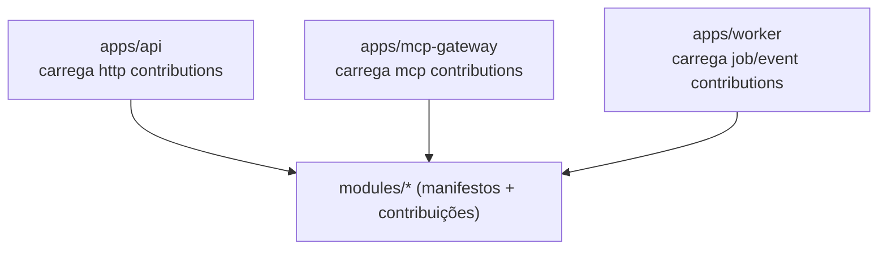

# Visão C4 — Nível 3: Componentes

## Anatomia de um módulo (arquitetura hexagonal)

Todo módulo em `modules/<nome>` segue a mesma estrutura e as mesmas regras de
dependência:

```text
modules/crm/src/
├── domain/          entidades, value objects, serviços de domínio, eventos, erros
├── application/     use-cases, commands, queries, dto, policies
├── ports/           interfaces: repositories, services, event-publishers
├── adapters/        http (REST), mcp, persistence (Drizzle), jobs, events
├── contracts/       public-api.ts, events.ts, schemas.ts  ← único ponto importável
├── crm.module.ts    wiring NestJS (adapters → use cases → ports)
└── manifest.ts      ModuleManifest + ModuleContributions
```



### Regras de dependência (impostas por lint e por pacotes)

Permitido: `adapters → application → domain`; `application → ports`;
`adapters → ports` (implementação).

Proibido — o `domain` **não** conhece: NestJS, banco/Drizzle, HTTP, MCP, Redis,
bibliotecas de UI. Proibido também: importar `src/**` interno de outro módulo
(somente `contracts/`), e módulo acessar tabela de outro módulo.

## Componentes do kernel (packages/*)

| Pacote | Componente | Papel |
|---|---|---|
| `platform-kernel` | ModuleRegistry, PluginRegistry | Carrega manifestos, resolve dependências entre módulos, monta contribuições por app |
| `tenant-context` | TenantContext (AsyncLocalStorage) | Propaga `{ tenantId, userId, correlationId }` da borda à persistência |
| `auth` | AuthN, emissão/validação de tokens | Identidade de usuários, service accounts e clients |
| `permissions` | PolicyEngine (RBAC + ABAC + scopes) | Decisão de autorização server-side, única para REST/MCP/jobs |
| `database` | Drizzle client, RLS session, migrations runner | Conexão com `SET app.tenant_id`, repositórios base |
| `event-bus` / `outbox` | Publisher transacional, dispatcher | Eventos internos e de integração com exactly-once-ish |
| `observability` | OTel setup, logger estruturado | Trace/log/métrica com tenant + correlation ID |
| `config` | Env schema (zod) | Configuração validada no boot; boot falha cedo |
| `validation` | Schemas compartilhados | Validação de borda |
| `api-client` | SDK gerado do OpenAPI | Único cliente HTTP do frontend |
| `plugin-sdk` / `mcp-sdk` | Contratos de extensão | Superfícies para plugins e contribuições MCP |

## Composition roots



Cada app monta apenas os adapters da sua borda; casos de uso, domínio e ports são os
mesmos pacotes — regra de negócio única por construção.
