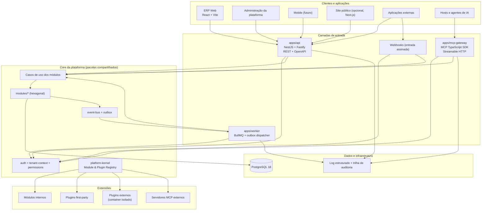
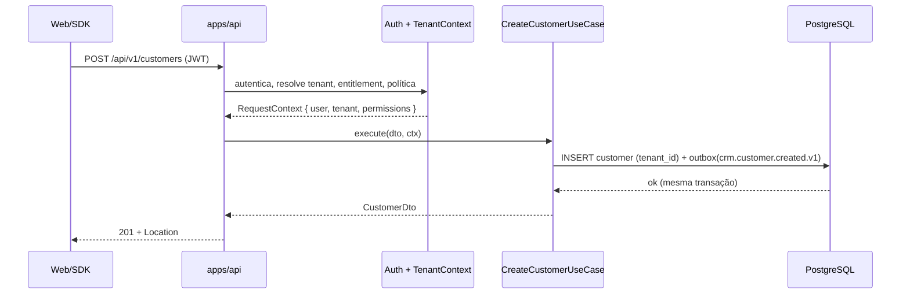
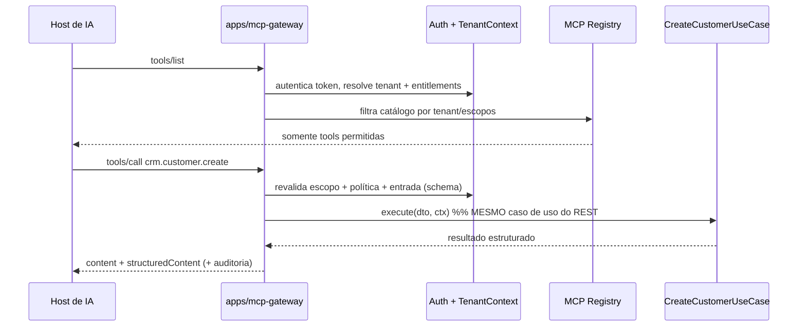

# Visão C4 — Nível 2: Containers

## Containers e responsabilidades

| Container           | Responsabilidade                                                 | Escala                                 |
| ------------------- | ---------------------------------------------------------------- | -------------------------------------- |
| `apps/api`          | REST versionada, OpenAPI, autenticação, webhooks de entrada      | Horizontal (stateless)                 |
| `apps/mcp-gateway`  | Descoberta e execução de tools/resources/prompts MCP             | Horizontal (stateless)                 |
| `apps/worker`       | Outbox dispatcher, jobs BullMQ, handlers de eventos, integrações | Horizontal (competing consumers)       |
| `apps/web`          | SPA interna (React + Vite) consumindo o SDK gerado               | CDN/estático                           |
| `apps/plugin-admin` | Gestão de módulos/plugins por tenant (fase 6)                    | —                                      |
| `apps/site`         | Páginas públicas/SEO (opcional, Next.js)                         | —                                      |
| PostgreSQL          | Fonte de verdade, RLS, outbox                                    | Vertical + réplicas de leitura futuras |
| Redis               | Cache segmentado por tenant, filas BullMQ                        | Gerenciado                             |

Os três processos backend são **composition roots** distintos dos mesmos módulos —
inicializações diferentes, regra de negócio única.

## Sequência crítica — fluxo REST

## Sequência crítica — fluxo MCP

