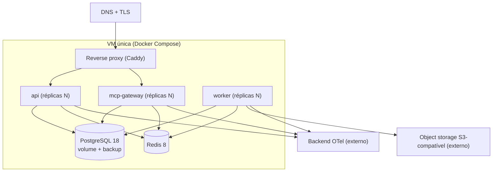
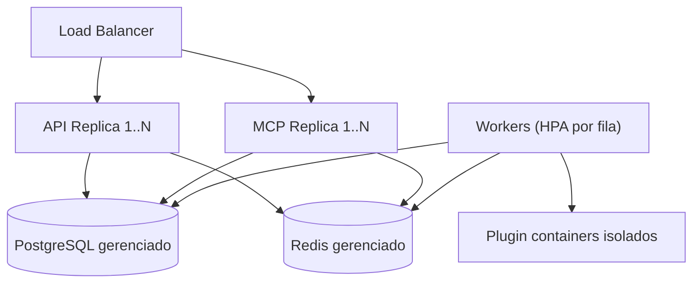

# Visão de implantação

## Ambiente de desenvolvimento

`docker/docker-compose.yml` sobe PostgreSQL 18 e Redis 8 com health checks; apps
rodam localmente via pnpm. Variáveis validadas por schema no boot (falha cedo).

## Produção inicial (MVP): uma VM com Docker Compose

## Evolução (Kubernetes-ready, Fase 11)

## Princípios (desde a Fase 1)

- **Stateless**: API e MCP sem estado em memória entre requests (workflows usam ids
  persistidos) — escala horizontal trivial.
- **12-factor**: config por ambiente via env validada; mesma imagem para todos os
  ambientes.
- **Migrations controladas**: passo explícito de deploy, nunca automático no boot de
  réplica.
- **Health/readiness** por app; **graceful shutdown** (drenar conexões/jobs).
- **Deploy independente** de api, mcp-gateway e worker (imagens distintas do mesmo
  monorepo).
- **Backup** diário do Postgres + teste de restore periódico (runbook na Fase 10/11).
- **Zero-downtime**: rolling por réplica atrás do proxy; migrations
  backward-compatible (expand/contract).
