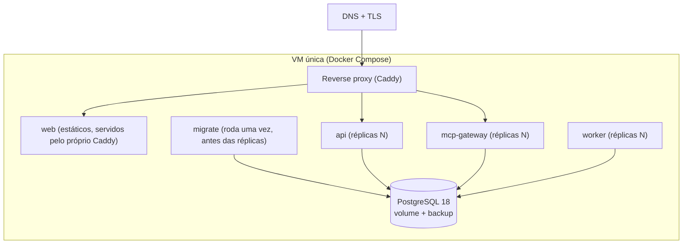
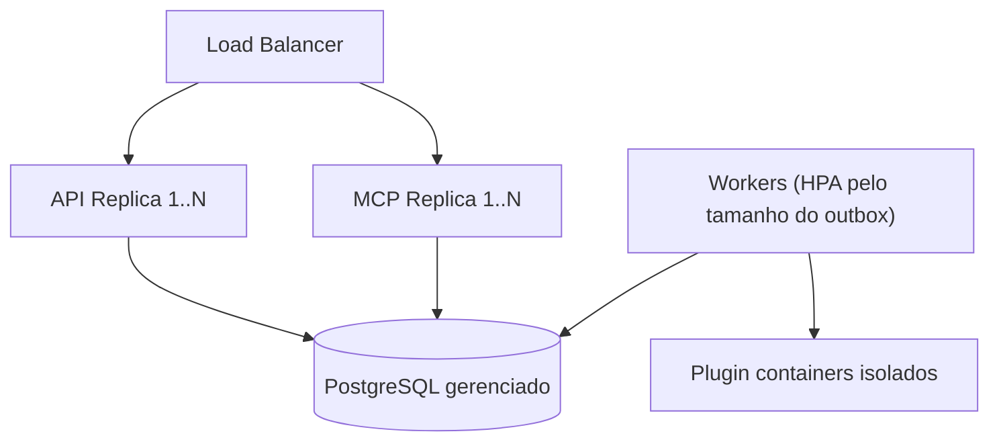

# Visão de implantação

> **Isto é a visão.** O que existe e roda está em
> [docs/operations/deploy.md](../operations/deploy.md), com os arquivos em
> `docker/`. Decisões em [ADR-0015](../adr/0015-implantacao.md).
>
> Duas coisas desenhadas na Fase 0 **não** se confirmaram e saíram do quadro
> abaixo: **Redis** (o outbox é a fila — ADR-0012 — e o rate limit conta em
> memória — ADR-0014) e **object storage** (nenhum módulo guarda arquivo
> ainda). Voltam quando houver o caso de uso, não antes.

## Ambiente de desenvolvimento

`docker/docker-compose.yml` sobe PostgreSQL 18 e Redis 8 com health checks; apps
rodam localmente via pnpm. Variáveis validadas por schema no boot (falha cedo).

## Produção inicial (MVP): uma VM com Docker Compose

O `migrate` usa a conexão do **dono** das tabelas; os três serviços usam o
papel restrito. Sem essa separação a RLS não vale (ADR-0007).

## Evolução (Kubernetes-ready) — ainda não implementada

Uma VM com Compose atende o MVP. Manifestos de Kubernetes escritos antes de
alguém rodá-los envelhecem sem ninguém notar — entram quando uma VM não bastar.

## Princípios (desde a Fase 1)

- **Stateless**: API e MCP sem estado em memória entre requests (workflows usam ids
  persistidos) — escala horizontal trivial.
- **12-factor**: config por ambiente via env validada; mesma imagem para todos os
  ambientes.
- **Migrations controladas**: passo explícito de deploy, nunca automático no boot de
  réplica.
- **Health/readiness** por app; **graceful shutdown** (drenar conexões/jobs).
- **Deploy independente** de api, mcp-gateway e worker (imagens distintas do mesmo
  monorepo).
- **Backup** diário do Postgres + teste de restore periódico
  ([runbook](../operations/runbooks.md#backup-e-restauração); agendar ainda é
  manual).
- **Zero-downtime**: rolling por réplica atrás do proxy; migrations
  backward-compatible (expand/contract).
