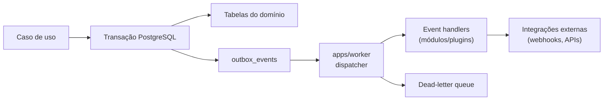

# Modelo de eventos e processamento assíncrono

> **Estado (Fase 8, ADR-0012)** — O outbox transacional está implementado em
> `packages/events`, e os cinco módulos verticais publicam de verdade. O
> dispatcher vive em `apps/worker`, com retry, backoff exponencial, DLQ e
> replay. **Não há broker**: o outbox é a fila, por `for update skip locked` e
> `available_at`. A entrega é **at-least-once** — handler idempotente é
> requisito, não recomendação.

## Arquitetura: event bus interno + transactional outbox



O evento é gravado **na mesma transação** da alteração de domínio; o dispatcher do
worker publica depois (at-least-once). Falha temporária de integração jamais desfaz a
transação principal nem derruba a API.

## Envelope do evento

```jsonc
{
  "id": "uuid v7", // id único do evento
  "type": "crm.customer.created.v1",
  "occurredAt": "2026-08-20T12:00:00Z", // UTC
  "tenantId": "uuid",
  "correlationId": "uuid", // atravessa toda a cadeia
  "causationId": "uuid", // evento/comando que causou este
  "actor": { "kind": "user|service|system", "id": "…" },
  "payload": {}, // schema versionado por type
}
```

## Convenções

- Eventos são **fatos ocorridos**: nomeados no passado, com versão explícita —
  `crm.customer.created.v1`, `billing.invoice.issued.v1`.
- Mudança incompatível de payload ⇒ novo sufixo `.v2`; o anterior continua publicado
  durante o período de depreciação.
- Eventos **internos** (mesmo processo) podem ser síncronos ao commit; eventos de
  **integração** sempre passam pela outbox.

## Esquema da outbox (referência para a Fase 2/8)

```sql
CREATE TABLE outbox_events (
  id             uuid PRIMARY KEY,
  tenant_id      uuid NOT NULL,
  type           text NOT NULL,
  payload        jsonb NOT NULL,
  occurred_at    timestamptz NOT NULL,
  correlation_id uuid NOT NULL,
  causation_id   uuid,
  processed_at   timestamptz,
  attempts       int NOT NULL DEFAULT 0,
  next_retry_at  timestamptz,
  last_error     text
);
CREATE INDEX ON outbox_events (processed_at, next_retry_at) WHERE processed_at IS NULL;
```

## Garantias de processamento

| Requisito       | Implementação                                                                                                |
| --------------- | ------------------------------------------------------------------------------------------------------------ |
| Idempotência    | Handlers registram `(handler, event_id)` processados; reentrega é no-op                                      |
| Retries         | Backoff exponencial com jitter; máximo de tentativas por handler                                             |
| DLQ             | Esgotadas as tentativas ⇒ dead-letter com payload + erro, alarme e replay controlado                         |
| Ordem           | Garantida apenas por agregado quando necessário (partição por chave); consumidores não assumem ordem global  |
| Duplicação      | Publisher marca `processed_at` com lock (`FOR UPDATE SKIP LOCKED`); consumidores idempotentes cobrem o resto |
| Observabilidade | Cada hop propaga correlation/causation + tenant para logs e traces                                           |

## Catálogo inicial de eventos

```text
identity.user.created.v1
tenancy.tenant.created.v1
tenancy.entitlement.granted.v1
crm.customer.created.v1
crm.customer.updated.v1
commercial.proposal.approved.v1
contracts.contract.activated.v1
operations.rental.started.v1
billing.invoice.issued.v1
finance.payment.received.v1
maintenance.work-order.completed.v1
notifications.message.sent.v1
```

Schemas de payload vivem em `contracts/events.ts` de cada módulo (zod), exportados
para consumidores e validados em teste de contrato.
