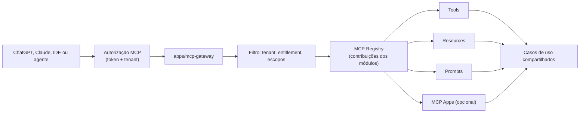

# Modelo MCP

Decisão registrada no [ADR-0004](../adr/0004-mcp-gateway.md).

## MCP × OpenAPI — papéis distintos, casos de uso únicos

| Use MCP para | Use OpenAPI para |
|---|---|
| Descoberta de capacidades por agentes | Aplicações tradicionais e SDKs |
| Consulta de contexto e execução de intenções de negócio | Integrações determinísticas sistema-a-sistema |
| Workflows guiados, prompts, resources, MCP Apps | Webhooks e automações |

Ambos chamam **os mesmos casos de uso** — regra de negócio única (ADR-0001).

## Arquitetura do gateway



- Transporte de produção: **Streamable HTTP**; `stdio` opcional só para dev/testes.
- Cada módulo exporta `McpContribution { tools, resources, prompts, apps }` no
  manifesto; o gateway agrega e filtra por tenant.
- Estado explícito: workflows multi-etapa usam ids opacos persistidos (`workflowId`,
  `draftId`, `approvalId`), revalidando usuário, tenant, escopo, propriedade e
  expiração a cada chamada. Nada depende de memória da conexão.

## Convenção de nomes

```text
<modulo>.<entidade>.<acao>          crm.customer.search
plugin.<id>.<entidade>.<acao>       plugin.whatsapp.message.send
```

Validar a convenção contra as regras de nomes da versão MCP adotada (teste de
compatibilidade no CI da Fase 5).

## Design de tools — regras

- Representam **intenções de negócio** (`commercial.proposal.approve`), não CRUD
  espelhado sem justificativa.
- Proibidas tools genéricas: `execute_sql`, `run_arbitrary_code`, `call_any_url`,
  `read_any_table`, `update_any_record`.
- Toda tool declara: descrição, input schema, output schema, permissões/escopos,
  leitura×escrita, idempotência, paginação, timeout, tratamento de erro, auditoria e
  correlation ID.
- Escritas críticas exigem idempotency key e, quando apropriado, preview/confirmação.

## Catálogo inicial (Fase 5 — módulo CRM)

| name | purpose | input | output | requiredScopes | R/W | idempotente | useCase |
|---|---|---|---|---|---|---|---|
| `crm.customer.search` | Pesquisar clientes por texto/filtros | query, filtros, page | lista paginada resumida | `crm.customer.read` | R | sim | SearchCustomersUseCase |
| `crm.customer.get` | Obter cliente por id | customerId | cliente completo | `crm.customer.read` | R | sim | GetCustomerUseCase |
| `crm.customer.create` | Cadastrar cliente | dados do cliente + idempotencyKey | cliente criado | `crm.customer.create` | W | por chave | CreateCustomerUseCase |
| `crm.customer.update` | Atualizar cliente | customerId + campos | cliente atualizado | `crm.customer.update` | W | sim (last-write) | UpdateCustomerUseCase |
| `crm.customer.history` | Histórico de interações | customerId, page | eventos paginados | `crm.customer.read` | R | sim | GetCustomerHistoryUseCase |

Resources: `crm://customers/{id}`, `crm://customers/{id}/history`.
Prompt: `crm.customer.analysis` (análise de relacionamento com dados do tenant).

O catálogo dos demais módulos entra fase a fase (ver
[roadmap](roadmap.md) e seção H do documento de kickoff).

## Federação (evolução, pós-MVP)

1. MVP: módulos internos registram contribuições direto no gateway.
2. Evolução: plugins/serviços externos expõem servidores MCP próprios; o gateway
   descobre, valida, aplica namespace, filtra por permissões, encaminha com timeout,
   circuit breaker, auditoria e prevenção de colisão de nomes.

Não implementar federação antes de o MCP local estar estável e testado.

## Segurança de credenciais

O modelo nunca vê tokens: fluxo OAuth iniciado e mantido pelo servidor, tokens
cifrados por tenant/usuário, renovação server-side, sem segredos em logs.

## Testes MCP (mínimo da Fase 5)

Descoberta; listagem e schemas; chamadas válidas; entradas inválidas; sem permissão;
isolamento entre tenants; expiração; paginação; idempotência; timeout; tool
inexistente; plugin indisponível; respostas estruturadas; compatibilidade de
protocolo (inspector oficial na versão adotada).
