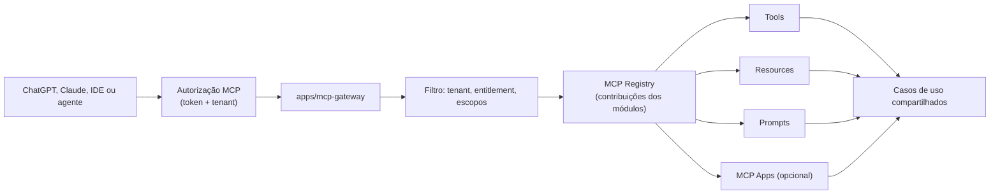

# Modelo MCP

Decisão registrada no [ADR-0004](../adr/0004-mcp-gateway.md).

## MCP × OpenAPI — papéis distintos, casos de uso únicos

| Use MCP para                                            | Use OpenAPI para                              |
| ------------------------------------------------------- | --------------------------------------------- |
| Descoberta de capacidades por agentes                   | Aplicações tradicionais e SDKs                |
| Consulta de contexto e execução de intenções de negócio | Integrações determinísticas sistema-a-sistema |
| Workflows guiados, prompts, resources, MCP Apps         | Webhooks e automações                         |

Ambos chamam **os mesmos casos de uso** — regra de negócio única (ADR-0001).

## Arquitetura do gateway



- Transporte de produção: **Streamable HTTP**, em modo **sem sessão** (ADR-0009) —
  estado de conexão seria um segundo lugar onde tenant e permissões existem, e é aí
  que mora a sessão que continua servindo depois do acesso revogado.
- Cada módulo exporta `McpContribution { tools, resources, prompts }`; o gateway
  agrega e filtra por tenant, módulo contratado, papéis e escopos.
- Estado explícito: workflows multi-etapa usam ids opacos persistidos (`workflowId`,
  `draftId`, `approvalId`), revalidando usuário, tenant, escopo, propriedade e
  expiração a cada chamada. Nada depende de memória da conexão.

## Convenção de nomes

```text
<modulo>.<entidade>.<acao>          crm.customer.search
plugin.<id>.<entidade>.<acao>       plugin.whatsapp.message.send
```

A compatibilidade de protocolo é verificada no CI pelo E2E do gateway, que usa o
**cliente oficial** do SDK contra o servidor de verdade: handshake, negociação de
versão e formato de resposta passam pela mesma biblioteca que os hosts usam.

## Design de tools — regras

- Representam **intenções de negócio** (`commercial.proposal.approve`), não CRUD
  espelhado sem justificativa.
- Proibidas tools genéricas: `execute_sql`, `run_arbitrary_code`, `call_any_url`,
  `read_any_table`, `update_any_record`.
- Toda tool declara: descrição, input schema, output schema, permissões/escopos,
  leitura×escrita, idempotência, paginação, timeout, tratamento de erro, auditoria e
  correlation ID.
- Escritas críticas exigem idempotency key e, quando apropriado, preview/confirmação.

## Catálogo entregue na Fase 5 (módulo CRM)

| name                       | intenção                            | requiredScopes             | R/W | useCase                    |
| -------------------------- | ----------------------------------- | -------------------------- | --- | -------------------------- |
| `crm.customer.search`      | Pesquisar clientes por texto        | `crm.customer.read`        | R   | SearchCustomersUseCase     |
| `crm.customer.get`         | Ficha do cliente com linha do tempo | `crm.customer.read`        | R   | GetCustomerUseCase         |
| `crm.customer.create`      | Cadastrar cliente                   | `crm.customer.create`      | W   | CreateCustomerUseCase      |
| `crm.note.add`             | Registrar nota de relacionamento    | `crm.note.create`          | W   | AddCustomerNoteUseCase     |
| `crm.appointment.schedule` | Agendar compromisso                 | `crm.appointment.schedule` | W   | ScheduleAppointmentUseCase |
| `crm.appointment.complete` | Concluir compromisso com desfecho   | `crm.appointment.update`   | W   | CloseAppointmentUseCase    |
| `crm.agenda.list`          | Consultar a agenda de um período    | `crm.appointment.read`     | R   | ListAgendaUseCase          |

Resources: `crm://customers/{customerId}` e `crm://customers/{customerId}/history`.
`resources/list` volta vazio de propósito — a carteira de clientes é paginada, não
enumerável como recurso. A descoberta acontece pelos templates.

Prompt: `crm.customer.analysis` — roteiro de análise já preenchido com ficha e
histórico do cliente, montado no servidor.

O catálogo mudou em relação ao planejado: `crm.customer.update` e
`crm.customer.history` viraram, respectivamente, borda REST e parte do
`crm.customer.get` — o histórico não é intenção separada, é o que a ficha carrega. O
escopo de notas e agenda entrou porque foi o que a Fase 3 entregou.

O catálogo dos demais módulos entra fase a fase (ver [roadmap](roadmap.md)).

### Como uma capacidade é declarada

O contrato (`McpToolDefinition`, `McpResourceDefinition`, `McpPromptDefinition`) vive
em `packages/mcp-kit`, e **nenhum símbolo do SDK MCP entra em `modules/`**: módulo
declara capacidade, o gateway conhece transporte. A contribuição é montada no
composition root (`crmMcpContribution(casos)`), não no manifesto — porque tool carrega
handler ligado a caso de uso, e o manifesto é dado puro.

O `McpCatalog` recebe o `AccessGrant` em todo método. Não existe "listar tudo":
descoberta e execução passam pela mesma decisão de autorização, então uma tool que não
aparece na listagem também não executa se o host adivinhar o nome. A montagem recusa
capacidade sem permissão declarada — ela seria visível e executável por qualquer
empresa.

## Federação (evolução, pós-MVP)

1. MVP: módulos internos registram contribuições direto no gateway.
2. Evolução: plugins/serviços externos expõem servidores MCP próprios; o gateway
   descobre, valida, aplica namespace, filtra por permissões, encaminha com timeout,
   circuit breaker, auditoria e prevenção de colisão de nomes.

Não implementar federação antes de o MCP local estar estável e testado.

## Segurança de credenciais

O modelo nunca vê tokens: fluxo OAuth iniciado e mantido pelo servidor, tokens
cifrados por tenant/usuário, renovação server-side, sem segredos em logs.

## Testes MCP

Cobertos pelo E2E do gateway (`apps/mcp-gateway/tests`), contra PostgreSQL real e com
o cliente oficial: descoberta filtrada por empresa, catálogo vazio para quem não
contratou o módulo e para vínculo sem permissão, execução do caso de uso, isolamento
entre empresas (busca e leitura por id), recusa de domínio como `isError`, entrada
inválida, tool inexistente, resources por URI, prompt preenchido, auditoria com canal
`mcp`, conexão sem credencial e com token adulterado.

Ainda não cobertos, por não existirem: paginação de capacidades, idempotência por
chave, timeout de plugin federado e plugin indisponível.
