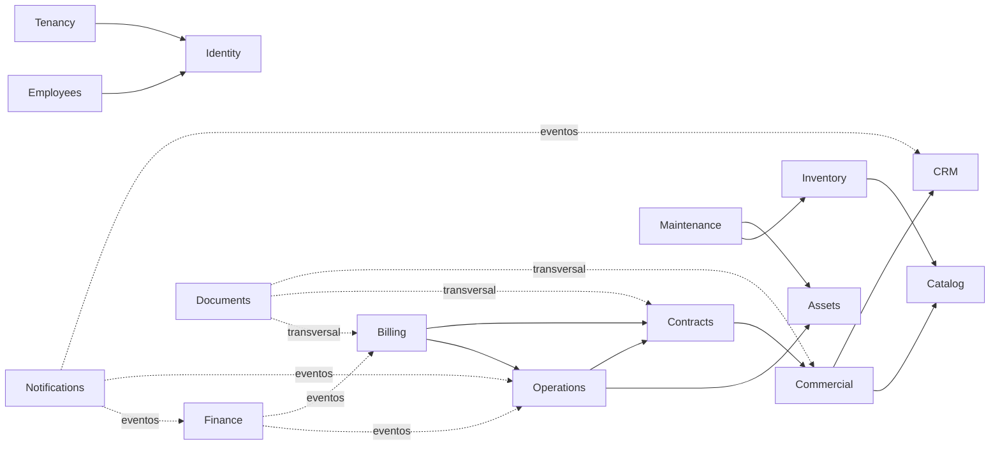

# Mapa dos módulos

## Diagrama de dependências

Setas sólidas = dependência de contrato (importa `contracts/` e casos de uso
exportados). Setas pontilhadas = reação por **eventos** (sem dependência de código).

O grafo é **acíclico**. Finance, Notifications e Documents reagem por eventos
justamente para não criar ciclos (ex.: Billing não conhece Finance; publica
`billing.invoice.issued.v1` e Finance projeta o título a receber).

## Responsabilidades, eventos e permissões

| Módulo            | Depende de                           | Eventos publicados (exemplos)                                   | Permissões (exemplos)                                    |
| ----------------- | ------------------------------------ | --------------------------------------------------------------- | -------------------------------------------------------- |
| **Identity**      | —                                    | `identity.user.created.v1`                                      | `platform.user.manage`                                   |
| **Tenancy**       | Identity                             | `tenancy.tenant.created.v1`, `tenancy.entitlement.granted.v1`   | `platform.module.manage`                                 |
| **Employees**     | Identity                             | `employees.employee.hired.v1`                                   | `employees.employee.read/create`                         |
| **CRM**           | —                                    | `crm.customer.created.v1`, `crm.customer.updated.v1`            | `crm.customer.read/create/update`                        |
| **Catalog**       | —                                    | `catalog.item.published.v1`                                     | `catalog.item.read/manage`                               |
| **Commercial** ✅ | CRM (Catalog: adiado, ver nota)      | `commercial.proposal.sent/approved/rejected.v1`                 | `commercial.proposal.read/create/update/send/approve`    |
| **Contracts** ✅  | Commercial                           | `contracts.contract.activated/finished/canceled.v1`             | `contracts.contract.read/create/activate/close`          |
| **Assets** ✅     | —                                    | `assets.asset.registered/unavailable/available/retired.v1`      | `assets.asset.read/manage/hold/retire`                   |
| **Inventory**     | Catalog                              | `inventory.stock.adjusted.v1`                                   | `inventory.stock.read/adjust`                            |
| **Operations**    | Contracts, Assets                    | `operations.rental.started.v1`, `operations.rental.finished.v1` | `operations.rental.create`, `operations.schedule.manage` |
| **Maintenance**   | Assets, Inventory                    | `maintenance.work-order.completed.v1`                           | `maintenance.work-order.schedule`                        |
| **Billing**       | Contracts, Operations                | `billing.invoice.issued.v1`                                     | `finance.invoice.read`, `billing.invoice.issue`          |
| **Finance**       | (eventos)                            | `finance.payment.received.v1`                                   | `finance.payment.approve`                                |
| **Documents**     | (transversal, por contrato genérico) | `documents.document.attached.v1`                                | `documents.document.read/attach`                         |
| **Notifications** | (eventos)                            | `notifications.message.sent.v1`                                 | `notifications.channel.manage`                           |

> **Nota (Fase 7)** — O Comercial foi entregue sem a dependência de Catalog: no escopo
> mínimo o item da proposta é descrito à mão, com preço e quantidade. Quando o Catalog
> existir, o item ganha uma referência opcional — nada do que já está gravado muda.
> A referência ao CRM passa pela superfície pública (`CrmPublicApi`), nunca pelas
> tabelas `crm_*`.
>
> **Nota (Fase 7)** — Assets foi entregue com quatro permissões, e não com as duas
> (`read`/`manage`) previstas aqui: operar o pátio (`hold`) é rotina diária de um
> papel que não cadastra patrimônio nem dá baixa. A separação tem teste E2E de
> alçada. A disponibilidade do ativo é **derivada dos bloqueios**, nunca uma
> coluna — quem consumir a `AssetsPublicApi` recebe a situação já calculada.
>
> **Nota (Fase 7)** — Contracts consome o Comercial pela `CommercialPublicApi`, também
> por chamada direta. As permissões usam o prefixo do próprio módulo
> (`contracts.contract.*`); a coluna deste mapa trazia `commercial.contract.approve`,
> que era engano de redação.

## Regras de comunicação entre módulos

1. **Contratos públicos** (`contracts/public-api.ts`) — tipos e casos de uso
   explicitamente exportados.
2. **Eventos internos** (in-process, síncronos ao commit) e **eventos de integração**
   (via outbox, assíncronos) — sempre nomeados no passado e versionados (`.v1`).
3. **Projeções de leitura autorizadas** — um módulo pode manter cópia local
   desnormalizada de dados de outro, alimentada por eventos (nunca por SELECT direto).
4. Proibido: importar `src/**` de outro módulo, acessar tabela de outro módulo,
   repositório compartilhado global, módulo `common` genérico.

## Ordem de implementação (fluxos verticais)

CRM → Commercial → Contracts → Assets → Operations → Billing → Finance → Inventory →
Maintenance → Employees. Identity e Tenancy vêm antes de todos (Fase 2); Documents e
Notifications entram como transversais quando o primeiro consumidor real existir.
