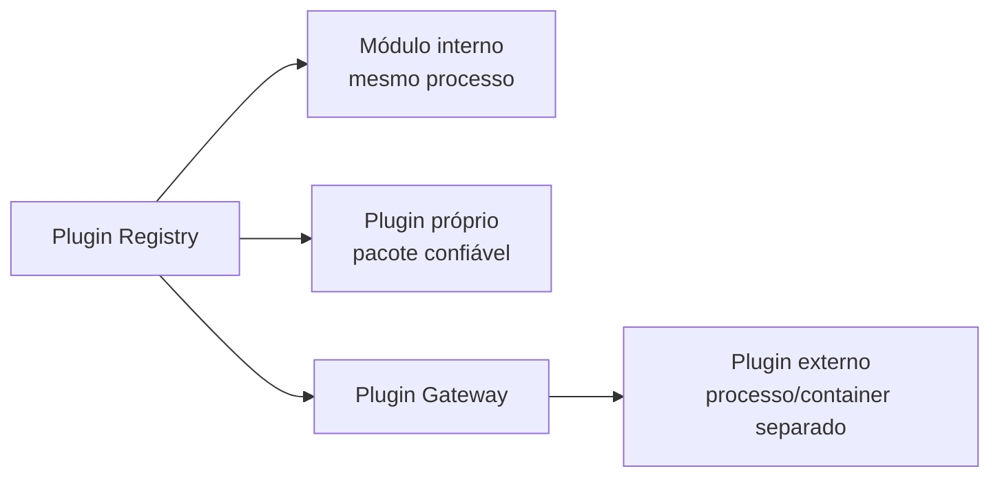

# Modelo de plugins e extensões

Decisão registrada no [ADR-0005](../adr/0005-plugin-isolation.md).

## Três categorias

|              | Módulo interno             | Plugin first-party                       | Plugin externo                                  |
| ------------ | -------------------------- | ---------------------------------------- | ----------------------------------------------- |
| Quem escreve | Equipe da plataforma       | Equipe da plataforma                     | Terceiros                                       |
| Onde executa | In-process (mesmo deploy)  | In-process, pacote confiável do monorepo | **Fora do processo** (container/serviço remoto) |
| Ativação     | Entitlement por tenant     | Instalação + configuração por tenant     | Instalação + permissões + gateway               |
| Exemplos     | CRM, Finance, Operations   | WhatsApp, Google Workspace, GitHub       | Integrações de parceiros                        |
| Registro     | Build/bootstrap controlado | Plugin Registry                          | Plugin Registry + Plugin Gateway                |
| UI           | App web principal          | Compilada junto ao app web               | iframe sandbox + CSP + postMessage validado     |



Nunca: download e execução de JavaScript arbitrário no processo principal (backend ou
frontend).

## Manifesto (validado por JSON Schema)

```json
{
  "manifestVersion": "1",
  "id": "whatsapp",
  "name": "Integração WhatsApp",
  "version": "1.0.0",
  "publisher": "ecoJotaduo",
  "type": "remote",
  "platformVersion": "^1.0.0",
  "permissions": ["crm.customer.read", "notifications.send"],
  "capabilities": { "http": true, "events": true, "mcp": true, "ui": true },
  "subscribesTo": ["crm.customer.created.v1"],
  "publishes": ["notifications.message.sent.v1"]
}
```

A validação vive em `packages/plugin-sdk/src/manifest.ts` (schema **Zod**, aplicado no
boot do catálogo — manifesto quebrado derruba o deploy, não a primeira instalação).
Além do formato, ela recusa: plugin que pede permissão sobre a própria capacidade
(seria escalada de acesso na instalação) e evento declarado em `subscribesTo` que
nenhum módulo publica (senão o erro de digitação ficaria em silêncio).

O arquivo `manifest.schema.json` versionado só faz sentido para autor **externo**, que
ainda não existe; ele é emitido do mesmo Zod quando o primeiro chegar (ADR-0010).

## Ciclo de vida por tenant

```text
available → installed → configured → enabled → healthy
                                        ↓
                                    disabled → uninstalled
```

Implementado na Fase 6 como `installed → configured → enabled ⇄ disabled`, em
`plugin_installations`. Dois estados do desenho original NÃO viraram coluna:
`available` é ausência de linha, e `healthy` é resultado de health check — guardá-lo
seria guardar uma informação que muda sozinha e passa a mentir.

Registrado por instalação: empresa, versão, configuração, permissões concedidas, datas
e status. O health check roda sob demanda, delegado ao próprio plugin.

**Habilitar é o que liga a capacidade**: uma instalação `enabled` contribui o
entitlement `plugin.<id>` para o `AccessGrant`, e as bordas existentes (REST e MCP)
passam a enxergar a capacidade sem código novo. Ativar ou desativar em uma empresa
**não** afeta as outras — é o critério de aceite da fase, verificado em E2E.

## Integração de plugins externos — contratos controlados

- **OpenAPI**: chamam a API pública com OAuth client + scopes concedidos.
- **Webhooks assinados**: recebem eventos com HMAC + timestamp + anti-replay.
- **Filas/eventos**: consomem via ponte publicada pelo worker (nunca acesso direto ao
  Redis interno).
- **MCP remoto**: expõem servidor MCP próprio, federado pelo gateway com namespace
  `plugin.<id>.*`, filtros, timeout, circuit breaker e auditoria.
- **plugin-sdk**: manifesto, runtime da chamada, verificação de permissão e health
  check. Deliberadamente pequeno: cresce quando um segundo plugin exigir, não antes
  (o risco nomeado desta fase é generalização precoce).

### Credenciais de integração

Ficam cifradas por empresa (AES-256-GCM, chave em `SECRETS_KEY`), com empresa, plugin e
chave no cabeçalho autenticado da cifra. **Nenhum caminho de leitura devolve valor** —
listagem mostra só as chaves configuradas, e a auditoria também. O valor sai do banco
uma única vez, para a memória do plugin, durante a chamada.

### Saída para a internet

Toda chamada de saída configurada pela empresa passa por guarda anti-SSRF: HTTPS
obrigatório, resolução de nome e recusa de endereço interno. Sem isso, "entregar no
endereço que a empresa configurou" seria a ferramenta `call_any_url` proibida com outro
nome.

## Interfaces de plugin

- First-party: componentes compilados no app web, atrás das permissões do tenant.
- Externo: iframe com `sandbox`, CSP estrita, sem tokens internos, comunicação
  exclusivamente por protocolo de mensagens versionado e validado (schema) —
  nenhuma capacidade além das concedidas.
