# Modelo de segurança

## Princípio central

Nenhuma descrição de ferramenta, interface, agente ou frontend é barreira de
segurança. **Toda** verificação acontece no servidor, em cadeia única e idêntica para
REST, MCP, webhooks, jobs e workers:

```mermaid
flowchart LR
    REQUEST["Request / tool call / job"] --> AUTHN["1. Autenticação<br/>(JWT, service account, OAuth client)"]
    AUTHN --> TENANT["2. Resolução de tenant<br/>(claim do token, nunca input livre)"]
    TENANT --> LICENSE["3. Entitlement<br/>(módulo contratado pelo tenant)"]
    LICENSE --> POLICY["4. Política<br/>(RBAC + ABAC + scopes)"]
    POLICY --> VALIDATE["5. Validação de entrada<br/>(schema zod/DTO)"]
    VALIDATE --> USECASE["6. Caso de uso<br/>(+ propriedade do registro)"]
    USECASE --> AUDIT["7. Auditoria"]
```



## Modelo de identidade e autorização

Entidades: `User`, `Organization`, `Tenant`, `Membership`, `Role`, `Permission`,
`Policy`, `Application`, `OAuthClient`, `ServiceAccount`, `ModuleEntitlement`,
`PluginInstallation`.

- **AuthN**: MVP com credenciais próprias (argon2) emitindo access token JWT de vida
  curta + refresh token rotacionado; service accounts e OAuth clients para
  máquina-a-máquina; estrutura pronta para federação OIDC corporativa.
- **RBAC**: papéis por tenant (`Membership → Roles → Permissions`).
- **ABAC**: políticas contextuais (ex.: aprovar proposta só do próprio escritório,
  limite de alçada por valor).
- **Scopes**: tokens de API e MCP carregam escopos; a interseção
  `scopes ∩ permissions ∩ entitlements` é o que vale.
- **Permissões** no formato `modulo.recurso.acao` (ex.: `crm.customer.create`,
  `finance.payment.approve`, `platform.plugin.install`) — declaradas no manifesto de
  cada módulo, nunca strings soltas.

Mapeamento MCP obrigatório (uma tool nunca contorna a API):

```text
MCP tool → required scopes → tenant entitlement → permission policy → use case
```

Mutações exigem: escopo específico, validação, idempotency key, auditoria e, quando
apropriado, modo de pré-visualização/confirmação.

## Threat model inicial (STRIDE por superfície)

| Superfície | Ameaça principal | Contramedida |
|---|---|---|
| REST API | IDOR / elevação (S, E) | Authz por registro no caso de uso; IDs opacos (UUIDv7); testes de IDOR |
| REST API | Injeção (T) | Drizzle parametrizado; validação zod na borda; sem SQL dinâmico |
| MCP | Prompt injection induz ação indevida (E) | Tools de intenção com escopo mínimo; confirmação/preview p/ ações destrutivas; auditoria; nunca tools genéricas |
| MCP | Tenant hopping pelo modelo (S) | Tenant vem do token, jamais de parâmetro da tool |
| Webhooks entrada | Spoofing/replay (S, R) | Assinatura HMAC + timestamp + janela anti-replay + idempotência |
| Filas/jobs | Reprocessamento duplo (T) | Idempotency key por job; handlers idempotentes; DLQ |
| Plugins externos | Código malicioso (E, I) | Out-of-process sempre; permissões explícitas; contratos assinados; circuit breaker |
| UI de plugin | Exfiltração via iframe (I) | Sandbox + CSP + protocolo de mensagens validado; sem tokens internos no iframe |
| Cache | Vazamento entre tenants (I) | Chaves prefixadas por tenant; testes de isolamento de cache |
| Logs/traces | Vazamento de dados sensíveis (I) | Scrub de segredos/PII; tenant sem payload sensível |
| Credenciais de integração | Roubo de tokens (I) | Cifrados at-rest (AES-GCM, chave em secret manager); nunca retornados ao modelo/logs; token de um serviço nunca usado em outro |
| Infra | DoS (D) | Rate limit por tenant/cliente; timeouts; paginação obrigatória |

## Auditoria

Toda ação relevante registra: quem (user/service account), tenant, interface
(REST/MCP/job/webhook), ferramenta ou endpoint, caso de uso, resultado, duração e
correlation ID — respondendo às oito perguntas do critério da Fase 10.

## Segredos

- Nunca em código ou logs; `.env` local fora do git; produção via secret manager.
- Tokens de terceiros: fluxo OAuth iniciado pelo servidor, vinculados a tenant/usuário,
  cifrados, renovados server-side, **nunca** transitam pelo modelo de IA.
