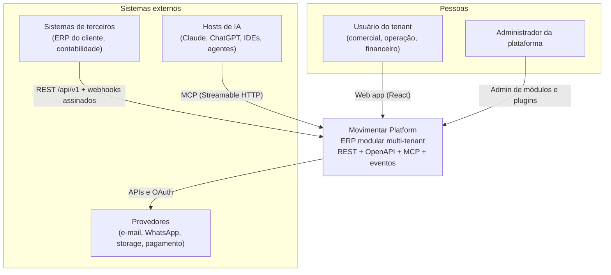

# Visão C4 — Nível 1: Contexto do sistema

A Movimentar Platform é um ERP modular multi-tenant que serve pessoas (operação
interna das empresas clientes), sistemas de terceiros e agentes de IA.

## Fronteiras

- **Dentro**: todos os módulos de negócio, identidade/tenancy, gateway MCP, workers,
  registry de módulos/plugins, dados (Postgres/Redis/objetos).
- **Fora**: hosts de IA, sistemas dos clientes, provedores de e-mail/mensageria/
  storage/pagamento, e plugins externos (executam fora do processo, ver
  [plugin-model.md](plugin-model.md)).

## Princípios de fronteira

1. Toda entrada (REST, MCP, webhook, job) passa pela mesma cadeia:
   autenticação → tenant → entitlement de módulo → política (RBAC/ABAC) → caso de uso
   → auditoria.
2. Nenhuma descrição de ferramenta, UI ou frontend é barreira de segurança — só o
   servidor decide.
3. Saídas para provedores externos passam por adapters com timeout, retry idempotente
   e circuit breaker.
