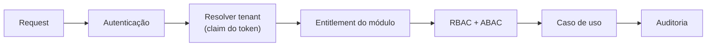

# Estratégia de multi-tenancy

Decisão registrada no [ADR-0002](../adr/0002-multi-tenancy.md).

## Estratégia do MVP

```text
PostgreSQL compartilhado
+ tenant_id NOT NULL nas tabelas de negócio
+ TenantContext obrigatório (AsyncLocalStorage)
+ repositórios exigem TenantId tipado
+ RLS como defesa em profundidade
+ testes de isolamento por módulo
```

## Fluxo de request



## Regras obrigatórias (checklist)

- [ ] Nenhuma consulta sem contexto de tenant — repositórios recebem `TenantId` na
      assinatura; não existe sobrecarga "sem tenant".
- [ ] `TenantContext` propagado por AsyncLocalStorage do middleware à persistência;
      conexão/transação executa `SET LOCAL app.tenant_id = $1` (base do RLS).
- [ ] Cache: toda chave prefixada `t:<tenantId>:…`.
- [ ] Filas: payload de job transporta `tenantId` explícito; o worker restaura o
      contexto antes de executar o handler.
- [ ] Eventos: envelope carrega `tenantId`, `correlationId`, `causationId`.
- [ ] Logs e traces incluem `tenant_id` (sem dados sensíveis no log).
- [ ] MCP: tools operam apenas no tenant autenticado; `tenantId` **nunca** é parâmetro
      de tool; o modelo não escolhe tenant.
- [ ] Testes automatizados por módulo tentando ler/alterar dados de outro tenant
      (devem falhar) — incluindo cache e jobs.
- [ ] Tabelas de plataforma (users, tenants, catálogo de módulos) são globais e
      explicitamente marcadas como tal; todo o resto é por tenant.

## RLS (defesa em profundidade)

Cada tabela de negócio recebe policy do tipo:

```sql
ALTER TABLE crm_customers ENABLE ROW LEVEL SECURITY;
CREATE POLICY tenant_isolation ON crm_customers
  USING (tenant_id = current_setting('app.tenant_id')::uuid);
```

A aplicação conecta com papel sem `BYPASSRLS`; mesmo uma query com bug de filtro não
cruza tenants.

## Evolução preparada (não implementar no MVP)

| Estratégia | Quando | O que muda |
|---|---|---|
| Schema por tenant | Cliente grande com exigência contratual | Resolver de conexão passa a mapear tenant → schema; migrations por schema |
| Banco por tenant | Cliente regulado / soberania de dados | Resolver mapeia tenant → connection string dedicada |
| Tenant dedicado (deploy) | Requisito extremo | Composição atual já permite deploy isolado com um único tenant |

A abstração de resolução de conexão em `packages/database` é o único ponto que muda;
domínio, casos de uso e adapters permanecem intactos.
